  
# Diffusion Everything  
Diffusion models are currently the go-to models in the field of Generative AI, be it images or video. This project aims to help users understand the process with three interactive demos. 
1. Diffusion on CIFAR-10: We trained multiple variants of diffusion models and the option to choose from different reverse samplers from the DDPM sampler to the latest DPM2++ sampler. You will find code snippets as well as a simple description of all the reverse samples. 
2. Latent Diffusion with MNIST: In this part, we first train a simple VAE on the MNIST dataset to map the dataset to a 2D distribution. Then we conditionally sample points from the 2D dataset using a diffusion model. 
3. Diffusion on 2D and 3D datasets: To gain an intuitive understanding of the sampling process we can train diffusion models on 2D shapes and custom drawings, then sample thousands of points using the diffusion model to recreate the complete dataset. 

## 1. Diffusion on CIFAR-10 Dataset
In this demo, you can visually see how noise is being added in the forward process of diffusion along with the variation of SNR (Signal to Noise Ratio) and $\bar{\alpha}$ along the time axis. 

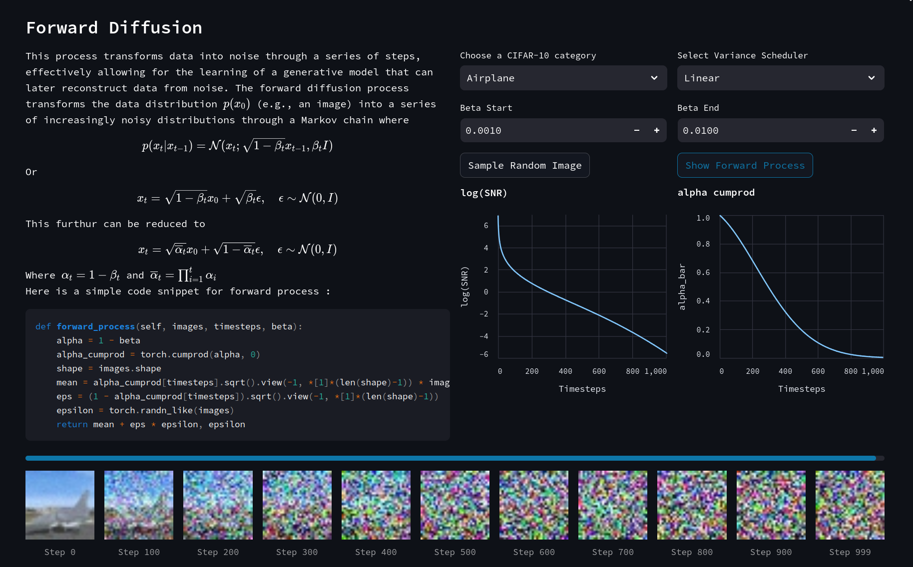  

After the forward process, we have illustrated the reverse diffusion process, along with a mathematical explanation and a code snippet of the main denoising process. You can choose the reverse sampler of your choice from the dropdown menu. 

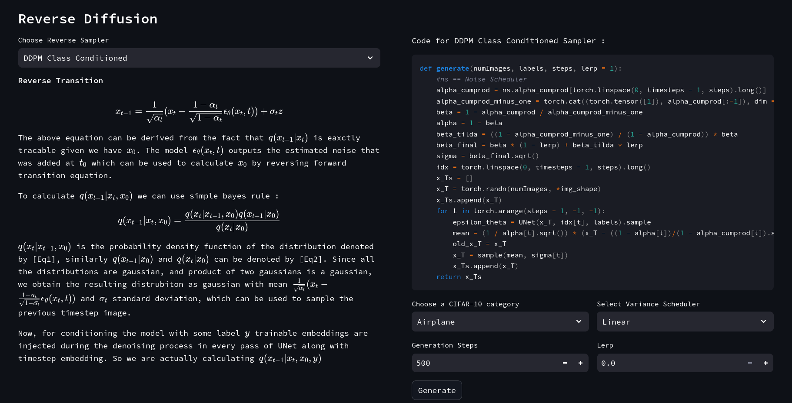

Further, you can click `Generate` to run a complete reverse process from a pre-trained model based on the above hyperparameters. The reverse steps will be shown live along with the estimated noise in the content/image.  

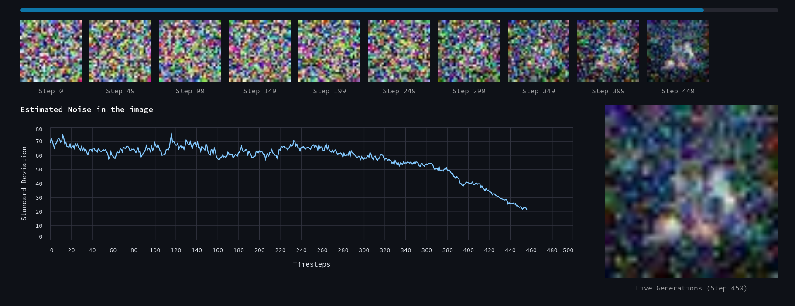


## 2. Latent Diffusion Model on MNIST Dataset 

The first step involves training a VAE (Variational Autoencoder) on MNIST to encode it into a 2D distribution, as you can see below while training the latent distribution organizes itself according to the category of the data after several iterations of training. 

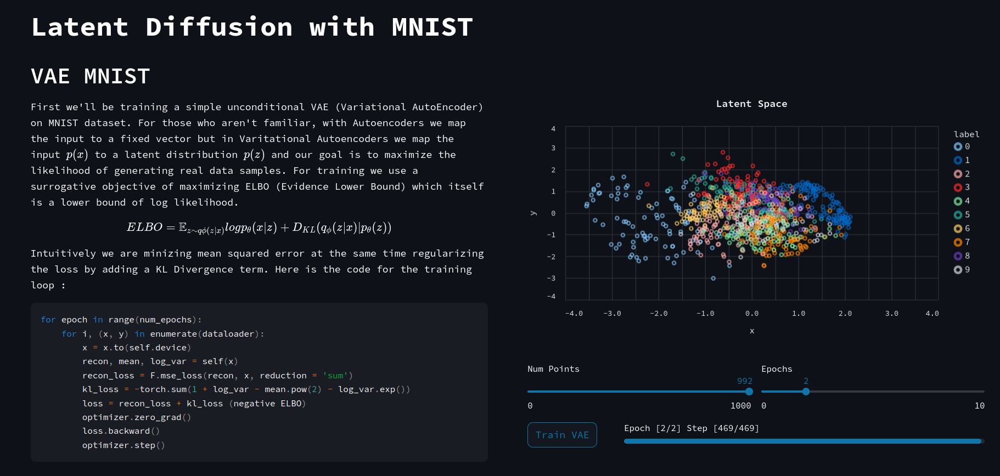

Next, if you apply a 3D kernel density estimation on the given data you can visually see the latent space distribution separated according to category. 

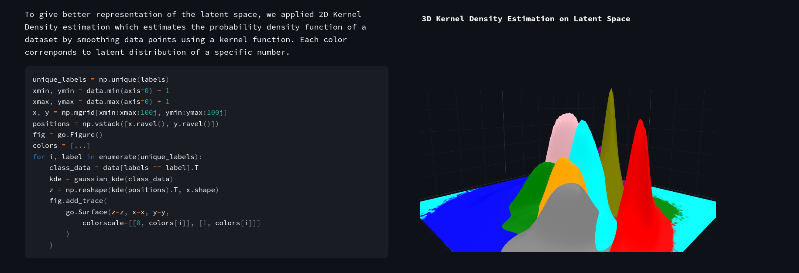

Next, we will train a diffusion model directly on the latent space created above using VAE.

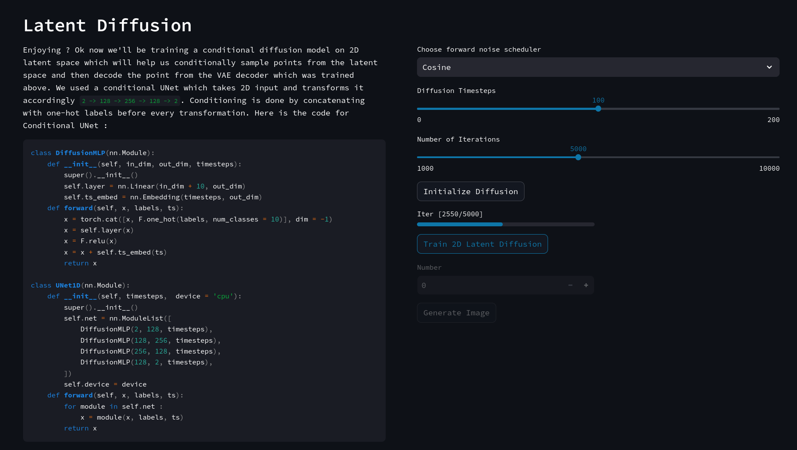

After training you can click on generate to see how a random point traverses the latent space to appropriate data distribution along with live VAE decoded content/images generated with decreasing timesteps. (The blue path indicates the path traversed by the point)

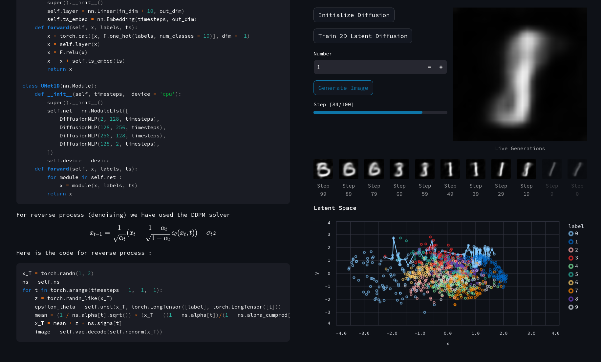

## 3. 2D and 3D Diffusion Demonstration

The way we trained a 2D latent distribution and sampled from it, in this demonstration we will generate our 2D data distribution and try to recreate it by sampling multiple times. First generate some 2D dataset from the dropdown list (PS: You can even draw and generate a custom dataset) 

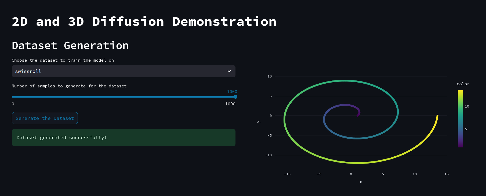

Then set the diffusion parameters and model hyperparameters accordingly and start training the model, since it's a 2D dataset with a small model, it will train within a few seconds. 

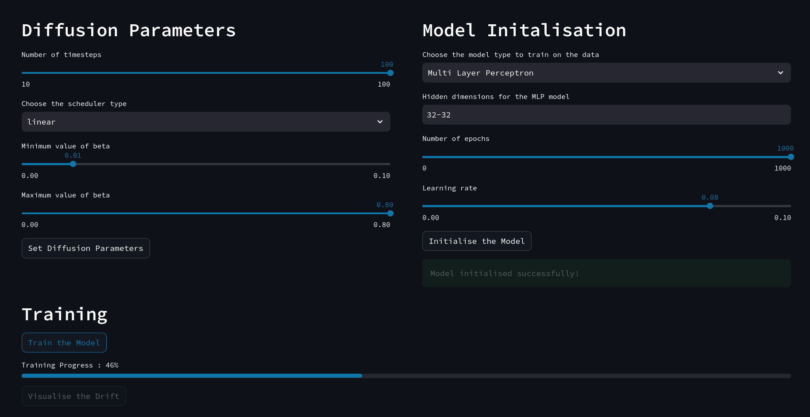

After training you can click generate and choose how many times you want to sample data and click generate. It also plots the points along with each reverse step so you can see how the distribution is transformed from a normal distribution to a well-defined data distribution. 

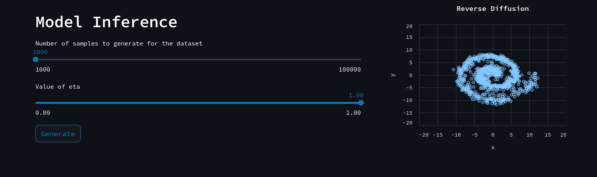 

After generating you can click `Visualise the Drift` to plot the vector fields showing the change in distribution and how these fields change with time. 

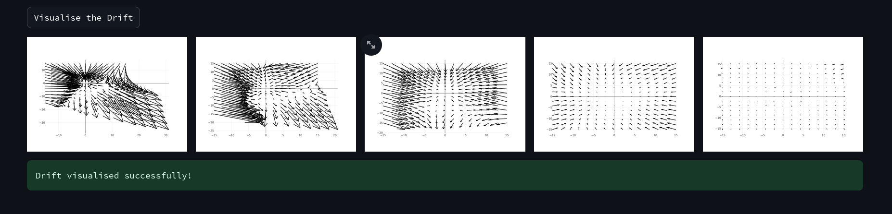


## Setup and Run
```bash 
git clone https://github.com/dsgiitr/Diffusion-Everything/
cd Diffusion-Everything 
mkdir ~/.streamlit 
mv config.toml ~/.streamlit/config.toml
pip3 install -r requirements.txt 
```
Before running make sure you download the pre-trained models using and set these two environment variables accordingly. We highly suggest using a device with a decent GPU for seamless experience. 
```
export DATASET=/home/user/datasets
export DEVICE=cuda
chmod +x ./download.sh
./download.sh
```
Now, to run the demos 
```
streamlit run diffusion-everything.py --server.port 80 --client.showSidebarNavigation False
```
## Usage 
Apart from the demos you can use  the codebase from VAE and Diffusion to run and train your own custom models. 
### Train Diffusion Model 
```
python3 diffusion.py --help
usage: diffusion.py [-h] [--timesteps TIMESTEPS] [--beta-start BETA_START] [--beta-end BETA_END] [--log-step LOG_STEP]
                    [--checkpoint-step CHECKPOINT_STEP] [--checkpoint CHECKPOINT] [--batch-size BATCH_SIZE] [--lr LR] [--num-epochs NUM_EPOCHS]
                    [--num-images NUM_IMAGES] [--generate] [--config CONFIG] [--output-dir OUTPUT_DIR] [--scheduler SCHEDULER]

options:
  -h, --help            show this help message and exit
  --timesteps TIMESTEPS
                        Number of timesteps
  --beta-start BETA_START
  --beta-end BETA_END
  --log-step LOG_STEP
  --checkpoint-step CHECKPOINT_STEP
  --checkpoint CHECKPOINT
                        Checkpoint path for UNet
  --batch-size BATCH_SIZE
                        Training batch size
  --lr LR               Learning rate
  --num-epochs NUM_EPOCHS
                        Numner of training epochs over complete dataset
  --num-images NUM_IMAGES
                        Number of images to be generated (if any)
  --generate            Add this to only generate images using model checkpoints
  --config CONFIG       Path of UNet config file in json format
  --output-dir OUTPUT_DIR
  --scheduler SCHEDULER
```
Apart from command line interface the model can also me used by importing as a module 
```python
from diffusion import Diffusion 

model = Diffusion(
	betaStart = 1e-3, 
	betaEnd = 1e-2, 
	timesteps = 1000, 
	UNetConfig = "config.json", 
	scheduler = "linear", 
	checkpoint = "linear.ckpt", 
	device = "cuda"
)
model.train(
	dataloader = dataloader, 
	numEpochs = 10, 
	logStep = 50, 
	checkpointStep = 50, 
	lr = 1e-4
)

#Genrate Images
images = model.generate(
	num_images = 5, 
	labels = [0,1, 2, 3, 4]
)
```

## Contribution Guide 
Furthur contribution can be made by adding new reverse samplers and pre-trained models in the following format. 
Directory structure 
```
.
├── checkpoints
├── config.toml
├── content
│   ├── banner.png
│   ├── diffusion_2d.md
│   ├── favicon.png
│   ├── forward_diffusion.md
│   ├── intro.md
│   ├── latent_diffusion_intro.md
│   ├── latent_diffusion.md
│   ├── reverse_samplers_intro.md
│   ├── samplers
│   │   └── DDPM Class Conditioned
│   │       ├── code.md
│   │       └── info.md
│   └── vae.md
├── diffusion_everything.py
├── diffusion.py
├── download.sh
├── models.json
├── noise_scheduler.py
├── pages
│   ├── latent_diffusion.py
│   └── visual_diffusion_demos.py
├── README.md
├── requirements.txt
├── reverse_samplers
│   ├── ddpm.py
│   ├── __init__.py
│   └── sampler.py
├── style.css
├── utils.py
├── vae.py
└── visual_diffusion_demo
    ├── beta_scheduler.py
    ├── data.py
    ├── ddpm_ddim_inference.py
    ├── ddpm_ddim_training.py
    ├── model.py
    └── visualise.py
```
1. Edit `models.json` and add config and hyperparameters of your model
2. Add the download link in `download.sh`
2. Add the class of your sampler by inheriting the `ReverseSampler` parent class
3. Create `NameOfSampler` directory in "content/samplers" with two files named `intro.md` and `code.md`. Add its breif description in `intro.md` and sample code in `code.md` 


